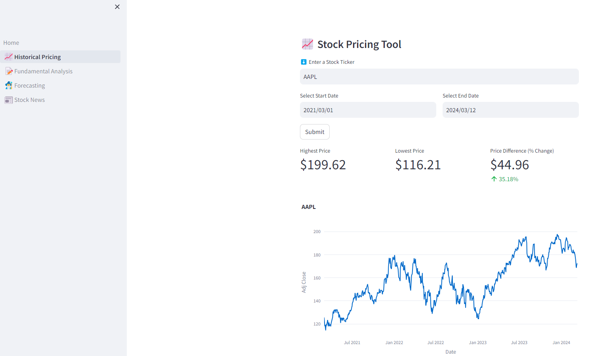
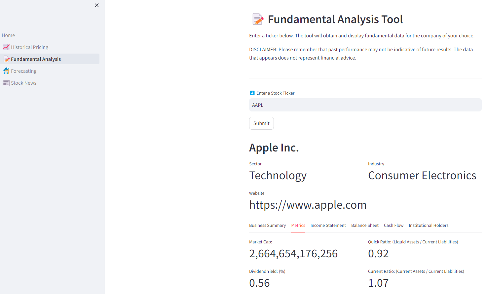
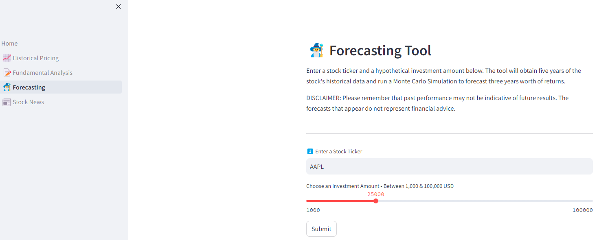
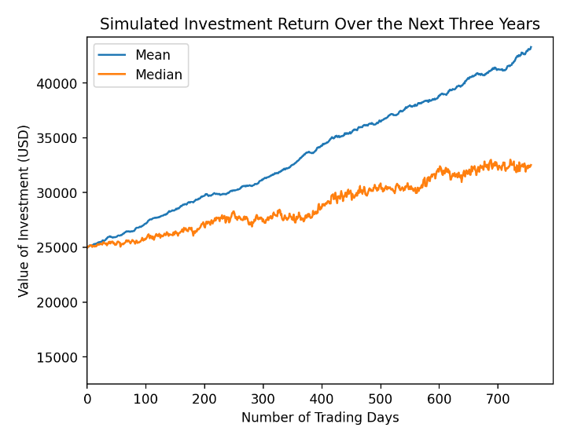
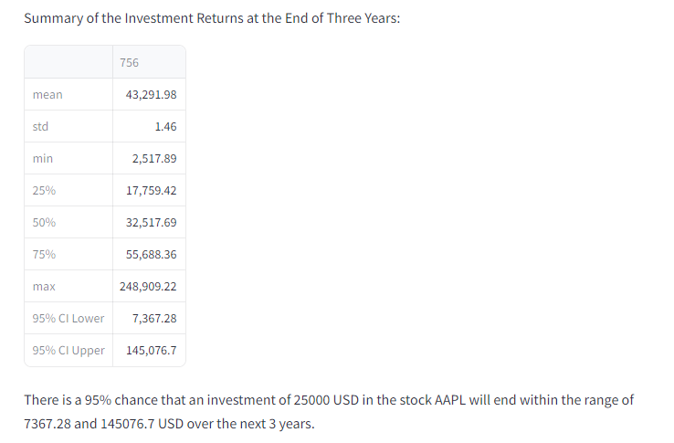
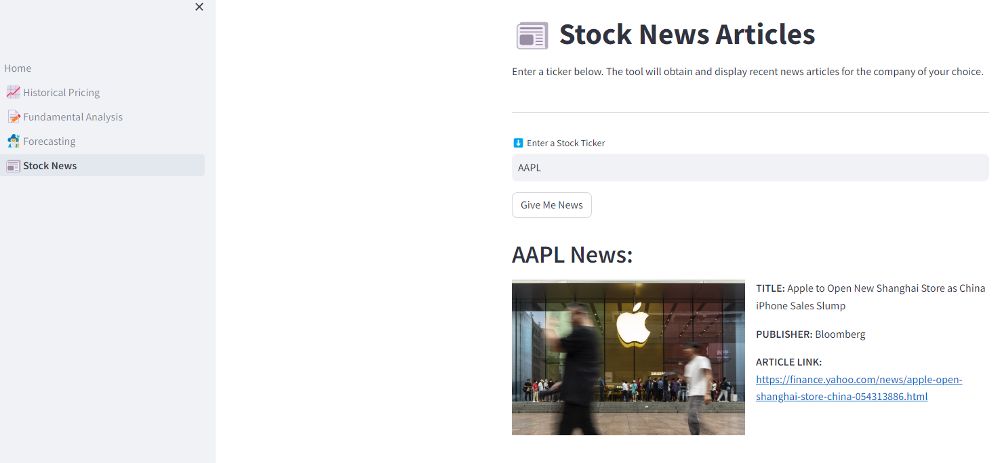

# **_Stock Analysis Tool!_**

This project was completed by Tyler Johnson and Ikaika Smith. It is the final capstone project for the ASU FinTech Bootcamp.


## **_Overview/Goal:_**
The goal of our project is to create a web application (using Streamlit) that will allow the user to 
simplify their stock analysis. The user will be able to enter a stock’s ticker and view the 
historical price of that stock, some of the company’s fundamentals, and recent news articles for 
the stock. They will also be able to run Monte Carlo Simulations to forecast future stock prices.

## **_Dependencies:_**

Run and install all libraries:

```bash
pip install streamlit yfinance plotly pandas alpaca_trade_api
```

## **_API Keys (Alpaca):_**
To use this package you first need to obtain an API Key and a Secret Key. Go here to [signup](https://app.alpaca.markets/signup). Note: Make sure to write down your secret key because you will only be able to see this once.

##### 1. Create a .env file:

      Create a new file in your project’s root directory and name it “.env”.
        
##### 2. Define your API Keys:

      In the .env file, define your API key with the descriptive names shown below:

      ALPACA_API_KEY = "Enter Alpaca API Key here"

      ALPACA_SECRET_KEY = "Enter Alpaca Secret Key here"

##### 3. Assign the value to the API Keys:

      Assign the actual API key values to the name you defined in step 2.
      
      For example, ALPACA_API_KEY = "asdjfdkbfjd127237123".

## **_Run the Streamlit-based Application:_**

Use streamlit to run the web application:

```bash
streamlit run Homy.py
```

## **_Explanation of the Stock Analysis Tool:_**
Below we will go over each page within the Stock Analysis Tool and provide a short description of what that page does. We will also provide images to give a general idea of what the output of each page looks like (using AAPL as an example).

#### **_Historical Pricing_**
This page will allow the user to enter a stock ticker and a date range of their choosing, and view the price movement of that stock over that time period. They will also be able to see the highest price, lowest price, and price difference and percent change over that time period.



#### **_Fundamental Analysis_**
This page will allow the user to enter a stock ticker and obtain useful fundamental data about that company.



#### **_Forecasting_**
This page will allow the user to enter a stock ticker and a hypothetical investment amount. The tool will use the inputs, gather five years of historical data for that stock, and run a Monte Carlo Simulation to forecast. They will also be able to see the simulated cumulative return and the simulated value of their investment over the next three years.







#### **_Stock News_**
This page will allow the user to enter a stock ticker and obtain some of the most recent news articles relating to that company.



## **_Conclusion_**
In conclusion, we hope this web application can provide useful tools to the user to assist with their stock research!
